## Czyszczenie danych

Przed przystąpieniem do analizy podjąłem proces czyszczenia danych. 
W pierwszej kolejności dokonałem wstępnego przeglądu danych w celu wykrycia nieprawidłowości. 

Wczytanie pliku:
``` r
cars <- read.table(file = "carsfix.txt", sep=",", dec=".", header=TRUE)
```

Wstępna analiza polegała na przejrzeniu danych oraz wykonaniu kilku wykresów na podstawie surowych danych które wspomogły wykrycie błędów.


                


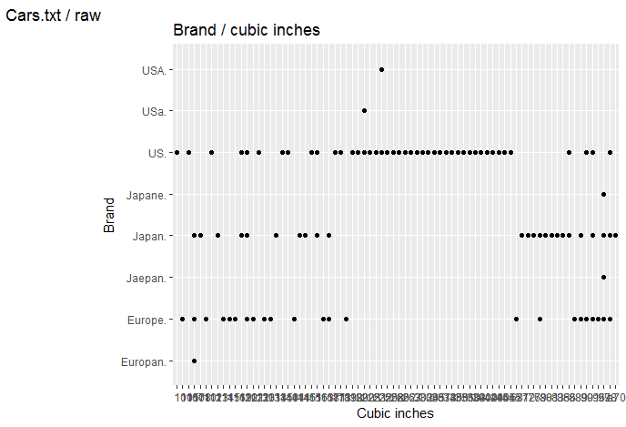
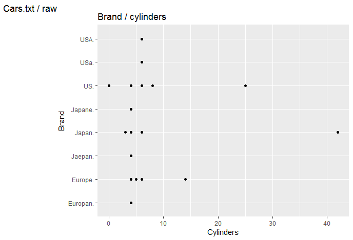

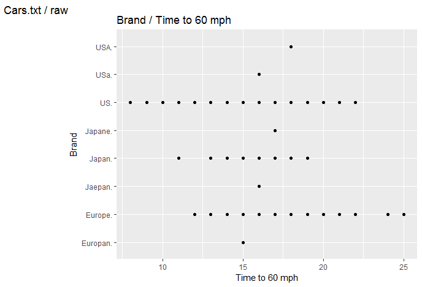
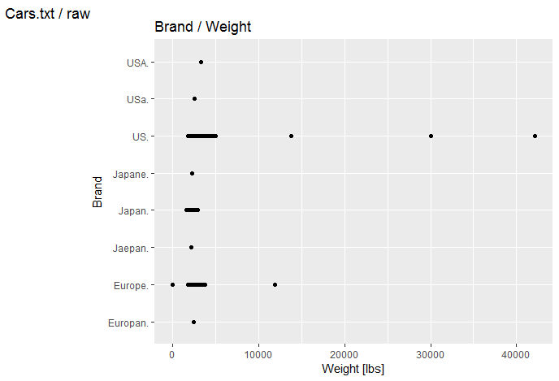
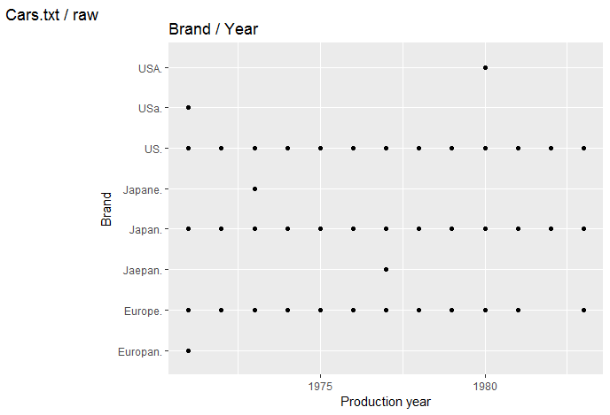


Kod generujący wstępne wykresy:
``` r 
ggplot(cars, aes(x=cars$mpg, y=cars$brand)) + geom_point() + labs(title = "Brand / mpg", tag = "Cars.txt / raw", x = "Miles Per Gallon", y = "Brand")

ggplot(cars, aes(x=cars$cylinders, y=cars$brand)) + geom_point() + labs(title = "Brand / cylinders", tag = "Cars.txt / raw", x = "Cylinders", y = "Brand")

ggplot(cars, aes(x=cars$cubicinches, y=cars$brand)) + geom_point() + labs(title = "Brand / cubic inches", tag = "Cars.txt / raw", x = "Cubic inches", y = "Brand")

ggplot(cars, aes(x=cars$hp, y=cars$brand)) + geom_point() + labs(title = "Brand / Horsepower", tag = "Cars.txt / raw", x = "Horsepower", y = "Brand")

ggplot(cars, aes(x=cars$weightlbs, y=cars$brand)) + geom_point() + labs(title = "Brand / Weight", tag = "Cars.txt / raw", x = "Weight [lbs]", y = "Brand")

ggplot(cars, aes(x=cars$time.to.60, y=cars$brand)) + geom_point() + labs(title = "Brand / Time to 60 mph", tag = "Cars.txt / raw", x = "Time to 60 mph", y = "Brand")

ggplot(cars, aes(x=cars$year, y=cars$brand)) + geom_point() + labs(title = "Brand / Year", tag = "Cars.txt / raw", x = "Production year", y = "Brand")
```

Na podstawie wykresów możemy zacząć wstępną analize przypadków. Widzimy że występują wartości skrajnie odbiegające od reszty oraz wartości nierealne (np. równe zeru lub ujemne). W przypadku zmiennej `brand` możemy zauważyć ze nie występuje ujednolicona wersja (np. USA, USa, US). 
W pierwszej kolejnosci zająłem się ujednoliceniem nazw marek za pomocą wyrażeń regularnych. Była to ostatnia zmiana jaką dokonałem na pliku. Kolejne będą wykonane w środowisku R.


Przed przystąpieniem do czyszczenia i uzupełniania danych podsumowanie `summary(cars)`
wyglądało nastepująco:

``` r
      mpg            cylinders       cubicinches          hp           weightlbs    
 Min.   :   0.00   Min.   : 0.000   Min.   :  3.0   Min.   :-125.0   Min.   :   25  
 1st Qu.:  16.70   1st Qu.: 4.000   1st Qu.: 98.0   1st Qu.:  75.0   1st Qu.: 2246  
 Median :  22.00   Median : 6.000   Median :156.0   Median :  95.0   Median : 2835  
 Mean   :  32.59   Mean   : 5.823   Mean   :199.4   Mean   : 116.2   Mean   : 3318  
 3rd Qu.:  28.90   3rd Qu.: 8.000   3rd Qu.:302.0   3rd Qu.: 139.0   3rd Qu.: 3672  
 Max.   :1236.00   Max.   :42.000   Max.   :455.0   Max.   :1175.0   Max.   :42135  
 NA's   :2         NA's   :1        NA's   :2                        NA's   :2    
 
   time.to.60         year         brand    
 Min.   : 8.00   Min.   :1971   Europe: 48  
 1st Qu.:14.00   1st Qu.:1974   Japan : 51  
 Median :16.00   Median :1977   US    :162  
 Mean   :15.55   Mean   :1977               
 3rd Qu.:17.00   3rd Qu.:1980               
 Max.   :25.00   Max.   :1983               
                 NA's   :2     
                 
```

## Usuwanie brakujacych danych

Następnie dokonałem zliczenia wartości NA (brakujące dane). Z 261 wierszy tylko w 9 miejcach brakowało danych. Uznałem że mogę pominąć te przypadki w dalszej analizie.

``` r
sum(is.na(cars))
```

Usunąłem wiersze zawierające dziury zostawiając tylko pełne przypadki
``` r
cars <- cars[complete.cases(cars),]
```


## Korekcja danych maksymalnych i nierealnych 

Dana zawierały również  błędy takie jak nierealne wartości. Błędem grubym były samochody ważące 19 ton które przyśpieszają do 60 mil w 13 sekund.
Kolejnym przykładem są 14,25,42 cylindrowe auta. Jedynym 14 cylindrowcem był Wärtsilä-Sulzer RTA96-C wyprodukowany w 2006 roku. Te błędy udało mi sie skorygować za pomocą zastępywania błednych wartości medianą z przypadków podobnych.

Poniżej podaje kilka przypadków dla których te wartości zostały zastępione. 
Jako że były to pojedyńcze przypadki a ich ilosć była mała postanowiłem dopasować przypadki względem najbardziej skorelowanej zmiennej. W przypadku pojemności silnika była to moc w KM.

``` r
cars$cubicinches[cars$cubicinches < 10] <- median(cars$cubicinches[cars$hp > 140 & cars$hp < 160 ])
```

Natomiast w przypadku spalania pojemność silnika

``` r
cars$mpg[cars$mpg == 0] <- median(cars$mpg[cars$cubicinches > 340 & cars$cubicinches < 360 ])
```


## Rezultaty czyszczenia danych

Podsumowanie danych po wyczyszczeniu prezentuje sie nastepująco:


``` r
      mpg          cylinders      cubicinches          hp          weightlbs   
 Min.   :10.00   Min.   :3.000   Min.   : 68.0   Min.   : 46.0   Min.   :1613  
 1st Qu.:16.50   1st Qu.:4.000   1st Qu.: 98.0   1st Qu.: 75.0   1st Qu.:2228  
 Median :22.00   Median :5.000   Median :156.0   Median : 95.0   Median :2790  
 Mean   :23.16   Mean   :5.574   Mean   :199.9   Mean   :105.9   Mean   :2988  
 3rd Qu.:28.60   3rd Qu.:8.000   3rd Qu.:302.0   3rd Qu.:139.0   3rd Qu.:3638  
 Max.   :46.60   Max.   :8.000   Max.   :455.0   Max.   :230.0   Max.   :4997  
 
   time.to.60         year          brand    
 Min.   : 8.00   Min.   :1971    Europe: 47  
 1st Qu.:14.00   1st Qu.:1974    Japan : 49  
 Median :16.00   Median :1977    US    :155  
 Mean   :15.59   Mean   :1977                
 3rd Qu.:17.00   3rd Qu.:1980                
 Max.   :25.00   Max.   :1983      
```


## Hstogramy po czyszczeniu danych
``` r
hist(cars$mpg, main = "Histogram spalania", breaks=8)
hist(cars$cylinders, main = "Histogram ilosci cylindrów", breaks=8)
hist(cars$cubicinches, main = "Histogram pojemnosci silnika [in^3]")
hist(cars$hp, main = "Histogram mocy [KM]")
hist(cars$weightlbs, main = "Histogram wagi [lbs]")
hist(cars$time.to.60, main = "Histogram przyspieszenia do 60 mil [s]")
hist(cars$year, main = "Histogram roku produkcji")
```

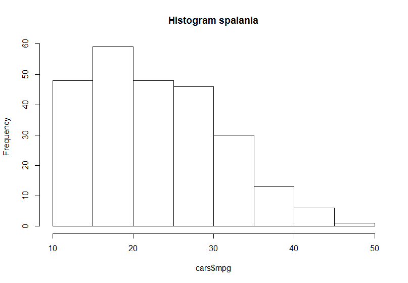
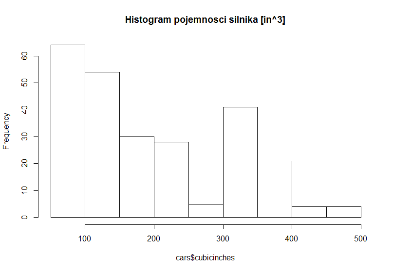
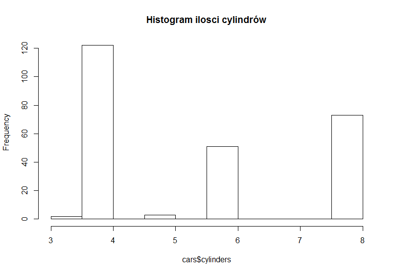
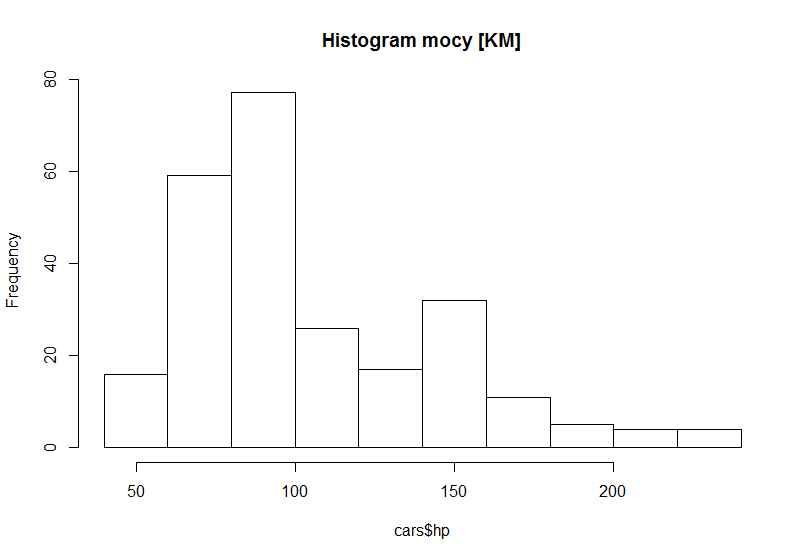
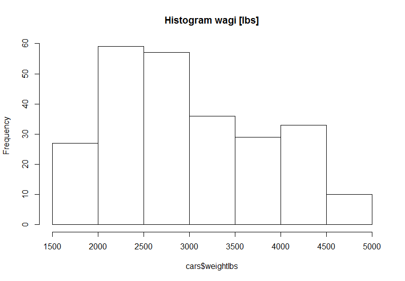
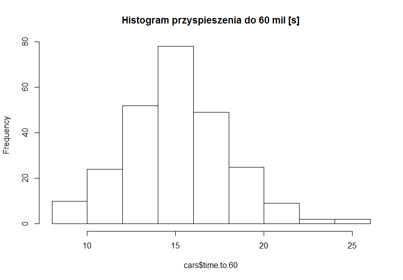
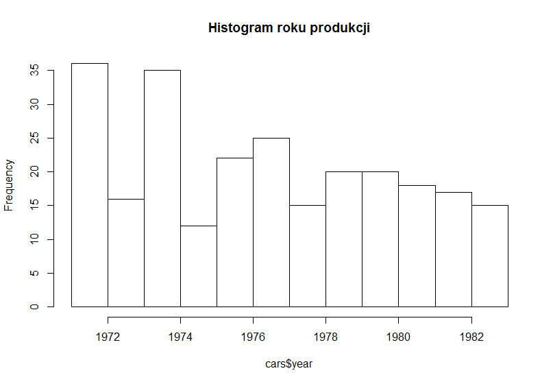


## Analiza

### Korelacja zmiennych: 
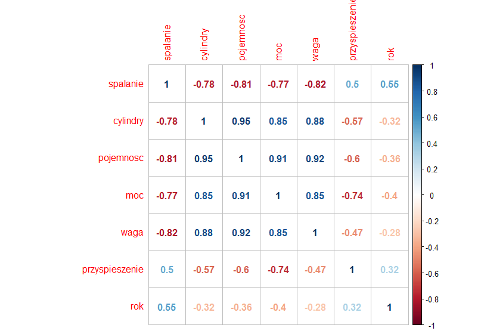

### Rozkład wagi i pojemności samochodów z podziałem na region pochodzenia oraz ilość cylindrów:

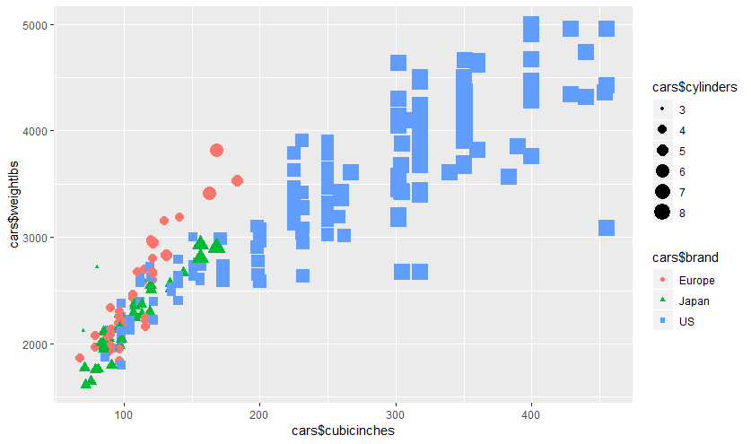


### Pojemność silnika do mocy:
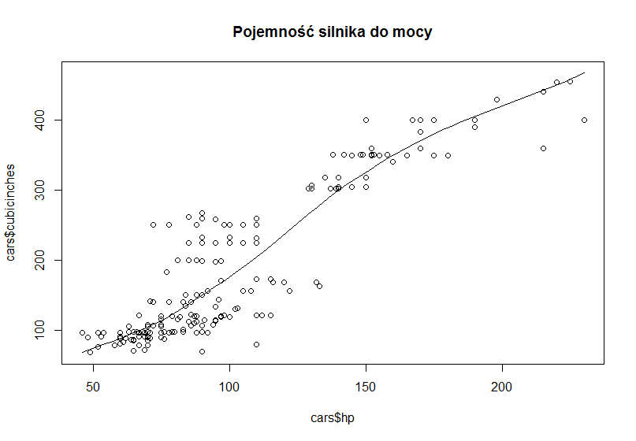

### Spalanie według kraju produkcji
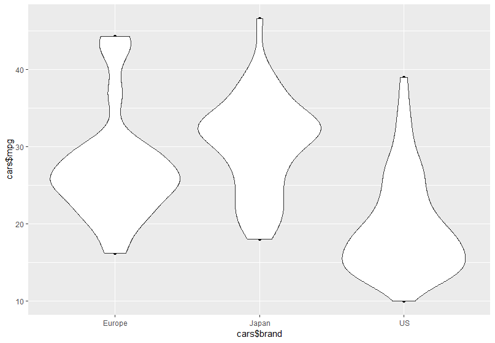

### Przyśpieszenie do 60 mil według kraju produkcji
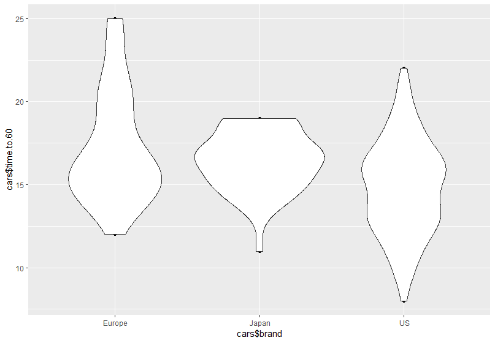
