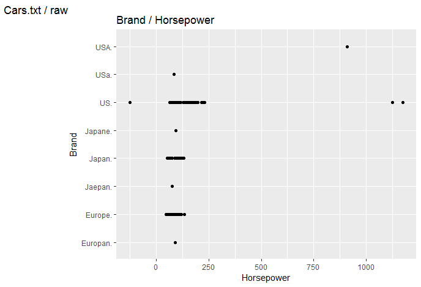

## Czyszczenie danych

Przed przystąpieniem do analizy podjąłem proces czyszczenia danych. 
W pierwszej kolejności dokonałem wstępnego przeglądu danych w celu wykrycia nieprawidłowości. 

Wczytanie pliku:
``` r
cars <- read.table(file = "carsfix.txt", sep=",", dec=".", header=TRUE)
```

Wstępna analiza polegała na przejrzeniu danych oraz wykonaniu kilku wykresów na podstawie surowych danych które wspomogły wykrycie błędów.





Kod generujący wstępne wykresy:
``` r 
ggplot(cars, aes(x=cars$mpg, y=cars$brand)) + geom_point() + labs(title = "Brand / mpg", tag = "Cars.txt / raw", x = "Miles Per Gallon", y = "Brand")

ggplot(cars, aes(x=cars$cylinders, y=cars$brand)) + geom_point() + labs(title = "Brand / cylinders", tag = "Cars.txt / raw", x = "Cylinders", y = "Brand")

ggplot(cars, aes(x=cars$cubicinches, y=cars$brand)) + geom_point() + labs(title = "Brand / cubic inches", tag = "Cars.txt / raw", x = "Cubic inches", y = "Brand")

ggplot(cars, aes(x=cars$hp, y=cars$brand)) + geom_point() + labs(title = "Brand / Horsepower", tag = "Cars.txt / raw", x = "Horsepower", y = "Brand")

ggplot(cars, aes(x=cars$weightlbs, y=cars$brand)) + geom_point() + labs(title = "Brand / Weight", tag = "Cars.txt / raw", x = "Weight [lbs]", y = "Brand")

ggplot(cars, aes(x=cars$time.to.60, y=cars$brand)) + geom_point() + labs(title = "Brand / Time to 60 mph", tag = "Cars.txt / raw", x = "Time to 60 mph", y = "Brand")

ggplot(cars, aes(x=cars$year, y=cars$brand)) + geom_point() + labs(title = "Brand / Year", tag = "Cars.txt / raw", x = "Production year", y = "Brand")
```

Na podstawie wykresów możemy zacząć wstępną analize przypadków. Widzimy że występują wartości skrajnie odbiegające od reszty oraz wartości nierealne (np. równe zeru lub ujemne). W przypadku zmiennej `brand` możemy zauważyć ze nie występuje ujednolicona wersja (np. USA, USa, US). 
W pierwszej kolejnosci zająłem się ujednoliceniem nazw marek za pomocą wyrażeń regularnych. Była to ostatnia zmiana jaką dokonałem na pliku. Kolejne będą wykonane w środowisku R.

## Usuwanie brakujacych danych

Następnie dokonałem zliczenia wartości NA (brakujące dane). Z 261 wierszy tylko w 9 miejcach brakowało danych. Uznałem że mogę pominąć te przypadki w dalszej analizie.

``` r
sum(is.na(cars))
```

## Korekcja danych maksymalnych i nierealnych 

Dana zawierały również  błędy takie jak nierealne wartości. Błędem grubym były samochody ważące 19 ton które przyśpieszają do 60 mil w 13 sekund.
Kolejnym przykładem są 14,25,42 cylindrowe auta. Jedynym 14 cylindrowcem był Wärtsilä-Sulzer RTA96-C wyprodukowany w 2006 roku. Te błędy udało mi sie skorygować za pomocą zastępywania błednych wartości medianą z przypadków podobnych.

Poniżej podaje kilka przypadków dla których te wartości zostały zastępione. Jako że były to pojedyńcze przypadki a ich ilosć była mała postaw

``` r
cars$cubicinches[cars$cubicinches < 10] <- median(cars$cubicinches[cars$hp > 140 & cars$hp < 160 ])
```


## Analiza


